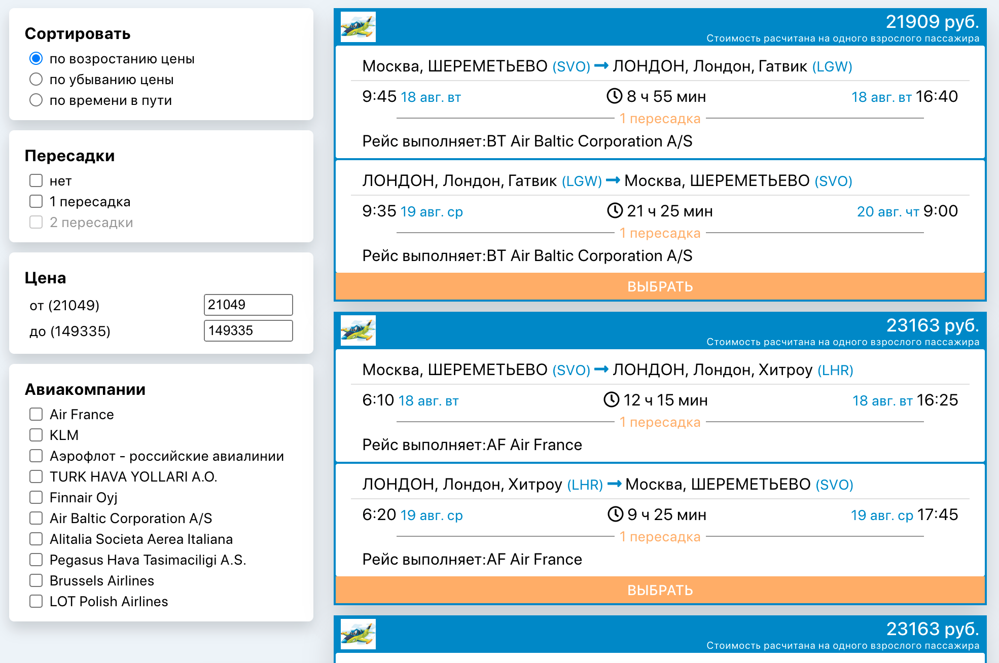

## Avia tickets finder (React/Test task for emploer)

## Test app for Gridnine systems  

***Technology stack: `React.JS, Redux`*** 

### 1. Task  
Design and render the flight search results page. The page should contain flight cards, and a filter block
. Filtering and sorting should not cause the page to reload. Filters should be based on input data. 

___

___

### 2. How to run  

``` npm start ``` - runs the app in the development mode. Open [http://localhost:3000](http://localhost:3000) to view
 it in the browser.

``` npm run build ``` - builds the app for production to the `build` folder.
